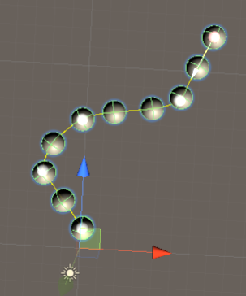
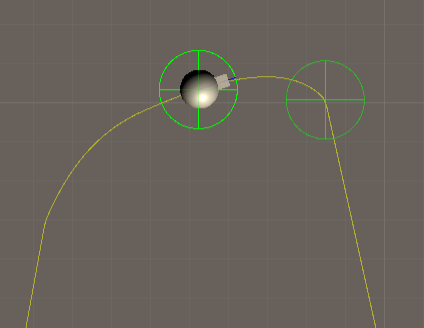
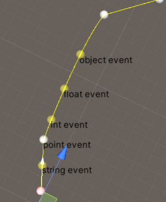
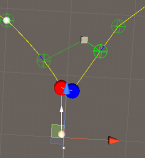

# Example

## Instantiate

`WaypointInstantiate` 组件

运行该场景，在路径上实例化 `prefab`

## Movement

`WaypointMovement` 组件

运行该场景，物体跟随路径移动，位置和角度跟随路径

## Event

路径触发事件，触发事件需要`WaypointTracker`组件

## Branch

测试分支功能

运行该场景，在两条路径之间拖动`Drag Me `物体，`Tracker` 节点跟踪当前所处在哪条路径。

