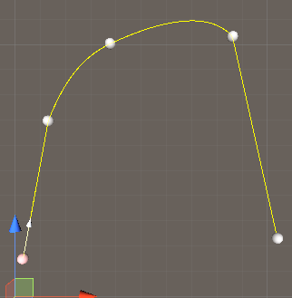

# Unity Waypoint

Unity 路径编辑器


## manifest.json


   ```
"unity.waypoint": "https://github.com/liuwenjiexx/Unity.Waypoint.git?path=/Assets/Plugins/Unity.Waypoint"
   ```


## 预览




### [样例](Assets/Example/README.md)

### [详细说明](Assets/Plugins/Unity.Waypoint/README.md)

